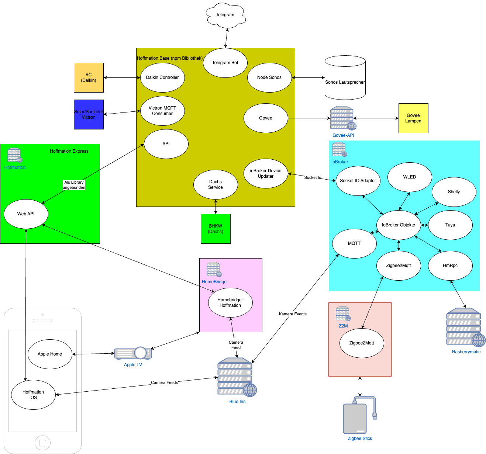

# Hoffmation-Base

A home automation library specialized for Zigbee and Homematic IP devices in combination with ioBroker.

## What does it do?

This project serves as library for home automation projects. It provides services, models and utilities necessary to
interact with rooms and smart devices via iobroker, but also to connect them to other services for textual/audio/visual
notifications or really just any code or service you want the devices to connect to.

Built on other open source projects that take care of the technical level, this project is made to provide a tool for
the coding on the logical level. It is built as base to write automation code independent of the ioBroker user interface
and currently provides support for the interaction with **devices** specified in [
`src/server/devices`](src/server/devices) and **services** that can be found in [
`src/server/services`](src/server/devices).

Those include, but are not limited to:

- **Devices**: Motion/Presence sensors, window handles, heating elements, lamps and dimmers, shutters, door contact
  sensors, physical buttons/switches, power sockets
- **Services**: Interaction service for a telegram bot, weather, sonos control, waste calendar

## Ecosystem Overview

## How can I use it?

This library *can* be used in conjunction with or as addition to own base projects, but it's intended to be used with
the configuration project [Hoffmation-Express](https://github.com/theimo1221/Hoffmation-Express) which uses this library
via a [npm package](https://www.npmjs.com/package/hoffmation-base).

Whether you use it with Hoffmation-Express or with your own controller code, make sure you pass a valid config file (
see [`src/server/config/private`](src/server/config/private) for an example) and a valid ioBroker device tree (you can
find more information about that in the Hoffmation-Express project).

### Base requirements

In order to get the library running correctly, the following requirements should be met:

* You use ioBroker for all devices that you want to control or read from
  Make sure you got the [socket.io](https://github.com/ioBroker/ioBroker.socketio) adapter installed
* You use devices that are supported or are able to use one of the supported devices as base for yours.  
  (If you use a Zigbee or Homematic IP device that is not currently supported, don't hesitate to create a pull request
  and add it!)
* You have a unix-based or windows device for the software you want to run this library with.

### Build

To build the library, make sure [Node.js](https://nodejs.org/en/download/) is installed.  
Then, just run `npm run build`.

## Why would I use it?

Even if it looks simple at first, automating your entire home with a user interface can sometimes be more difficult than
just *coding* your home.  
Especially if you have a lot of specialized requirements that you want to satisfy, it can be simpler to just code your
own rules and interfaces than to rely on user interfaces to do it for you.  
